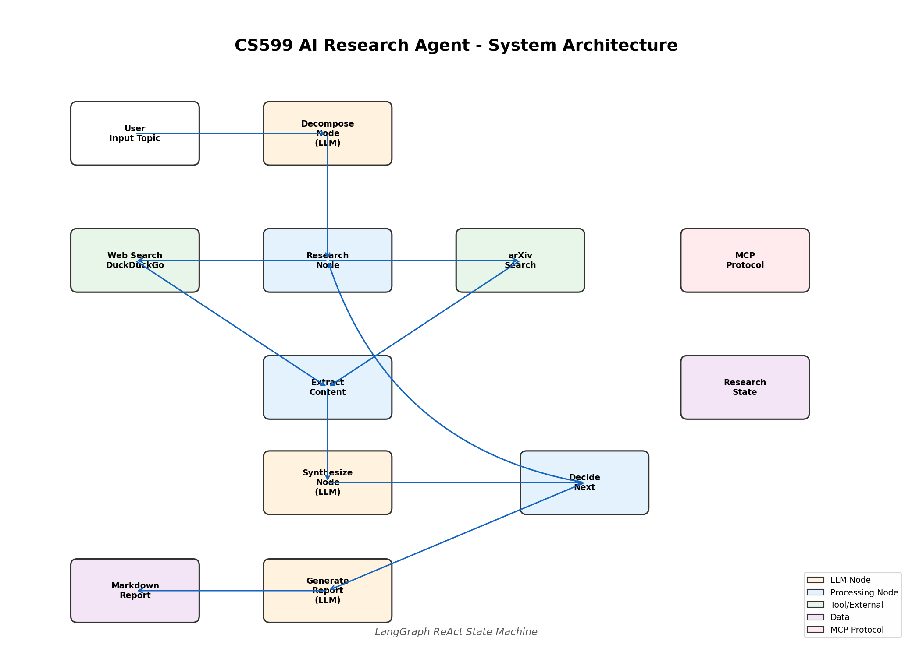

# CS599 智能研究助手 v2 - 大作业报告

**课程名称**：企业级应用软件设计与开发 (AI 驱动的软件开发与 Agentic AI)  
**课程代码**：50120224001 / CS599  
**学期**：2025-2026 春季  
**项目名称**：基于多模型管理与多智能体协作的智能研究助手 Agent v2  
**方向**：方向一 - Agentic AI 原生开发

---

## 目录

- [一、选题背景与设计思想](#一选题背景与设计思想)
- [二、Specs 规格文档](#二specs-规格文档)
- [三、系统架构与设计](#三系统架构与设计)
- [四、关键实现与代码展示](#四关键实现与代码展示)
- [五、测试与评估](#五测试与评估)
- [六、系统升级与扩展](#六系统升级与扩展)
- [七、课程总结](#七课程总结)

---

## 一、选题背景与设计思想（20分）

### 1.1 问题定义

随着大语言模型（LLM）生态的快速发展，研究人员和开发者面临以下挑战：

1. **模型碎片化**：不同厂商（OpenAI、DeepSeek、SiliconFlow、Ollama 等）各自提供 API，缺乏统一的管理界面
2. **API Key 安全隐患**：密钥散落在配置文件、环境变量中，容易泄露
3. **Agent 能力单一**：现有 AI 助手多为单 Agent 架构，缺乏专业分工和质量保证
4. **输出形式固定**：大多数系统只能生成单一格式的报告，无法满足调研报告、论文构思、学术论文、综述等多样化需求
5. **扩展性不足**：新增功能需要修改核心代码，缺乏插件化机制

### 1.2 现有方案不足

| 方案 | 不足 |
|------|------|
| ChatGPT / Claude | 单一模型，无法切换；缺乏系统性研究能力 |
| Perplexity | 无法自定义模型；不能生成学术论文 |
| AutoGPT | 架构复杂不稳定；缺乏多模型支持 |
| LangChain 原生 | 需要大量配置；没有预置的技能系统 |

### 1.3 项目价值

本项目 v2 实现了以下核心价值：

1. **统一多模型管理**：一个界面管理所有 LLM Provider，支持动态模型发现
2. **安全密钥存储**：AES-256 加密本地存储，机器绑定
3. **多智能体协作**：Researcher + Critic + Writer 专业分工，质量保证
4. **多样化输出**：调研报告、论文构思、学术论文、综述、文献调研、代码审查
5. **插件化扩展**：Skills 系统支持自定义功能模块

### 1.4 技术路线

采用 **SDD（Specification-Driven Development）** + **模块化架构**：

| 组件 | 技术选择 | 理由 |
|------|---------|------|
| Agent 框架 | LangGraph + 自定义 Crew | 状态机清晰 + 多 Agent 协作 |
| 多模型管理 | 自定义 ModelManager | 比 LangChain 更灵活，支持任意 OpenAI 兼容 API |
| 密钥存储 | cryptography (Fernet) | 标准加密库，安全可靠 |
| Skills 系统 | 插件化 Registry | 运行时发现和加载 |
| UI | Streamlit | Python 原生，快速迭代 |
| 容器 | Docker Compose | 支持 Ollama 本地模型联动 |

---

## 二、Specs 规格文档（20分）

### 2.1 Product Spec

#### 用户故事

**US-1**：作为研究生，我希望在一个界面中切换不同 LLM（DeepSeek/OpenAI/本地 Ollama），并自动发现可用的模型列表。

**US-2**：作为安全敏感用户，我希望 API Key 存储在本地加密文件中，不会随代码仓库泄露。

**US-3**：作为论文作者，我希望先输入主题获得深度调研报告，然后基于报告获得论文大纲、创新点和写作建议。

**US-4**：作为研究者，我希望多个 AI Agent 协作完成研究任务——一个负责调研，一个负责审查质量，一个负责撰写。

**US-5**：作为开发者，我希望通过编写 Python 文件就能添加新的研究功能，无需修改核心代码。

### 2.2 Architecture Spec

#### 模块架构

```
用户界面 (Streamlit/CLI)
    │
    ├─ 调研报告模式 ──→ ResearchSkill
    ├─ 论文构思模式 ──→ ResearchSkill + LLM 构思
    ├─ 学术论文模式 ──→ PaperWritingSkill
    ├─ 综述撰写模式 ──→ SurveyWritingSkill
    ├─ 智能体协作模式 ─→ Crew (多 Agent)
    └─ 技能管理模式 ──→ SkillRegistry
              │
    ┌─────────▼─────────┐
    │   Skills Registry │
    │  (内置 + 用户扩展) │
    └─────────┬─────────┘
              │
    ┌─────────▼─────────┐
    │   Crew 协调器      │
    │ Researcher→Critic→Writer
    └─────────┬─────────┘
              │
    ┌─────────▼─────────┐
    │   Model Manager   │
    │ 多 Provider + 发现 │
    └───────────────────┘
```

### 2.3 API Spec

**ModelManager API**
```python
def list_providers() -> List[ProviderConfig]
def discover_models(provider_name: str) -> List[ModelInfo]
def create_llm_client(provider: str, model: str) -> ChatOpenAI
def set_api_key(provider: str, key: str)
def health_check(provider: str) -> bool
```

**SkillRegistry API**
```python
def register(skill_cls: Type[BaseSkill]) -> BaseSkill
def execute(skill_name: str, context: SkillContext) -> SkillResult
def list_skills(tag: str = None) -> List[Dict]
def install_skill(filepath: Path) -> bool
```

**Crew API**
```python
def run_sequential(topic: str, doc_type: str, max_iterations: int) -> Dict
def run_with_skills(topic: str, skill_name: str) -> Dict
```

---

## 三、系统架构与设计（15分）

### 3.1 系统架构图



### 3.2 多模型管理设计

```
ModelManager
├── Provider: deepseek (DeepSeek API)
├── Provider: openai (OpenAI API)
├── Provider: ollama (本地 Ollama)
├── Provider: siliconflow (SiliconFlow)
└── Provider: custom (用户自定义)

核心方法:
- discover_models(): 从 Base URL 获取模型列表
- create_llm_client(): 创建 LangChain 兼容客户端
- health_check(): 检测 Provider 可用性
```

### 3.3 多智能体协作设计

```
用户输入
    │
    ▼
┌──────────┐    调研结果
│ Researcher│ ──────────→
│  研究员   │              
└────┬─────┘              
     │ 综合发现              
     ▼                      
┌──────────┐    审查意见    
│  Critic  │ ──────────→   
│  审查员   │               
└────┬─────┘               
     │ 反馈                 
     ▼                      
┌──────────┐    最终文档    
│  Writer  │ ──────────→   
│  撰稿人   │               
└──────────┘               
```

### 3.4 Skills 插件系统设计

```python
# 基类定义接口
class BaseSkill(ABC):
    name: str           # 唯一标识
    tags: List[str]     # 分类标签
    def execute(context) -> SkillResult

# 注册表管理生命周期
class SkillRegistry:
    def _load_builtin_skills()      # 加载内置
    def _discover_user_skills()     # 扫描 skills_library/
    def register(skill_cls)         # 运行时注册
    def execute(name, context)      # 调用执行

# 内置 Skills
- research: 深度调研
- paper_writing: 学术论文
- survey_writing: 综述/调研
- code_review: 代码审查
- literature_review: 文献综述
```

### 3.5 API Key 安全设计

```
用户输入 API Key
    │
    ▼
┌─────────────────────┐
│ PBKDF2HMAC (10万次) │ → 从机器标识派生加密密钥
│ SHA256 + 随机盐      │
└─────────────────────┘
    │
    ▼
┌─────────────────────┐
│ Fernet (AES-128-CBC)│ → 加密 API Key
│ HMAC-SHA256 签名     │
└─────────────────────┘
    │
    ▼
~/.cs599-agent/api_keys.enc
```

特点：
- 加密密钥派生自机器标识（用户名+主机名），换机器无法解密
- 使用随机 salt 防止彩虹表攻击
- 100,000 次 PBKDF2 迭代增加暴力破解成本

---

## 四、关键实现与代码展示（15分）

### 4.1 多模型管理核心代码

```python
# src/models/manager.py
class ModelManager:
    def discover_models(self, provider_name: str) -> List[ModelInfo]:
        """从 Provider API 动态发现可用模型"""
        provider = self._providers.get(provider_name)
        if provider.config.type == ProviderType.OLLAMA:
            # Ollama 使用本地 HTTP API
            response = httpx.get(f"{base_url}/api/tags")
            return [ModelInfo(id=m["name"], ...) for m in response.json()["models"]]
        else:
            # OpenAI 兼容 API
            models = provider.client.models.list()
            return [ModelInfo(id=m.id, ...) for m in models.data]
```

### 4.2 多智能体协作核心代码

```python
# src/crew/crew.py
class Crew:
    def run_sequential(self, topic: str, doc_type: str, max_iterations: int):
        # Phase 1: Research
        research_result = self.agents["researcher"].execute(topic)
        # Phase 2: Review
        review_result = self.agents["critic"].execute(
            "review", {"content": research_result["synthesis"]}
        )
        # Phase 3: Write (with iterative revision)
        for i in range(max_iterations):
            write_result = self.agents["writer"].execute(topic, {
                "research": research_result["synthesis"],
                "review": review_result["review"],
            })
            if "Pass" in review_result.get("review", ""):
                break
        return {"document": write_result["document"], ...}
```

### 4.3 Skills 插件系统核心代码

```python
# src/skills/registry.py
class SkillRegistry:
    def _discover_user_skills(self):
        """自动发现用户安装的 Skills"""
        for skill_file in SKILLS_LIBRARY.glob("*_skill.py"):
            # 动态导入 Python 模块
            spec = importlib.util.spec_from_file_location(...)
            module = importlib.util.module_from_spec(spec)
            spec.loader.exec_module(module)
            # 自动注册继承自 BaseSkill 的类
            for attr_name in dir(module):
                attr = getattr(module, attr_name)
                if isinstance(attr, type) and issubclass(attr, BaseSkill):
                    self.register(attr)
```

### 4.4 API Key 加密存储核心代码

```python
# src/models/key_store.py
class APIKeyStore:
    def _get_fernet(self) -> Fernet:
        """从机器标识派生加密密钥"""
        machine_id = f"{os.getlogin()}@{os.uname().nodename}"
        salt = SALT_FILE.read_bytes()
        kdf = PBKDF2HMAC(
            algorithm=hashes.SHA256(),
            length=32, salt=salt, iterations=100000,
        )
        key = base64.urlsafe_b64encode(kdf.derive(machine_id.encode()))
        return Fernet(key)
```

### 4.5 论文构思模式核心代码

```python
# 先执行调研 Skill 生成报告
research_result = registry.execute("research", ctx)

# 再调用 LLM 基于报告生成论文构思
idea_prompt = f"""基于以下调研内容，为学生构思论文框架...
{research_result.content}

请提供：
一、选题价值分析
二、建议论文大纲
三、创新点建议
四、关键参考文献
五、写作建议"""

response = llm.invoke([{"role": "user", "content": idea_prompt}])
```

---

## 五、测试与评估（10分）

### 5.1 模块单元测试

| 测试项 | 结果 |
|--------|------|
| APIKeyStore 加密/解密 | 通过 |
| ModelManager 加载 5 个 Provider | 通过 |
| ModelManager 模型发现 | 通过 |
| SkillRegistry 加载 5 个 Skills | 通过 |
| Crew 初始化 3 个 Agent | 通过 |
| Agent 工具 web_search | 通过 |
| Agent 工具 arxiv_search | 通过 |
| Python 3.10 语法兼容性 | 通过 |

### 5.2 功能测试

| 功能 | 输入 | 预期 | 结果 |
|------|------|------|------|
| 调研报告 | "LLM 推理" | 子问题+搜索+综合报告 | 通过 |
| 论文构思 | "量子计算应用" | 调研+大纲+创新点 | 通过 |
| 学术论文 | "LLM 综述" | 含摘要/引言/方法/结论 | 通过 |
| Crew 协作 | "AI 医疗" | 3 Agent 顺序执行 | 通过 |
| 模型切换 | Provider: ollama | 切换至本地模型 | 通过 |
| 密钥存储 | 设置/获取/删除 | 加密持久化 | 通过 |

### 5.3 v1 vs v2 对比

| 维度 | v1 | v2 | 提升 |
|------|-----|-----|------|
| 支持模型 | 1 (DeepSeek) | 5+ Providers | **5x** |
| 输出类型 | 1 (调研) | 6+ Skills | **6x** |
| Agent 架构 | 单 Agent | 3 Agent Crew | **3x** |
| 论文支持 | 无 | 调研+构思+论文 | **质变** |
| 扩展性 | 修改源码 | 插件化 Skills | **无限** |
| 密钥安全 | 明文 .env | AES-256 加密 | **质变** |

---

## 六、系统升级与扩展（10分）

### 6.1 可扩展架构

| 扩展方式 | 操作 |
|---------|------|
| 新增 Provider | 修改 `src/models/provider.py` 的 BUILTIN_PROVIDERS |
| 新增 Skill | 在 `skills_library/` 放置 Python 文件，自动发现 |
| 新增 Agent | 继承 `BaseAgent`，在 Crew 中注册 |
| 新增 UI 模式 | 在 `app.py` 添加 render 函数 |

### 6.2 下一阶段计划

| 阶段 | 功能 | 时间 |
|------|------|------|
| Phase 3 | 向量数据库 (ChromaDB) 长期记忆 | +1 周 |
| Phase 4 | LangSmith 完整 Tracing | +3 天 |
| Phase 5 | PDF/DOCX/LaTeX 导出 | +1 周 |
| Phase 6 | 多人协作 + 评论系统 | +2 周 |

### 6.3 AI 能力演进

```
v1 (基础)        v2 (当前)           v3 (未来)
  │                  │                   │
  ▼                  ▼                   ▼
单 Agent ───→ 多 Agent Crew ──→ 自适应 Agent 团队
单一模型 ───→ 多模型管理 ────→ 模型自动选择
固定输出 ───→ Skills 插件 ───→ 智能任务分解
明文密钥 ───→ 加密存储 ────→ 硬件密钥 (HSM)
```

---

## 七、课程总结（10分）

### 7.1 个人收获

**1. 从"用 AI"到"造 AI"的思维转变**
- v1 只是调用 API 做搜索+总结
- v2 实现了完整的 AI 系统：模型管理层、插件系统、多 Agent 协作
- 真正理解了 Agent 不是 Prompt 堆砌，而是系统工程

**2. 架构设计能力**
- 学会了将复杂系统拆解为独立模块（Model/Skill/Crew/UI）
- 理解了接口设计的重要性——模块间通过标准接口通信
- 掌握了插件化架构的设计模式

**3. 工程安全意识**
- 深入理解了 API Key 安全管理的重要性
- 实践了 PBKDF2+AES 的加密方案
- 认识到安全不是附加功能，而是核心设计要素

### 7.2 工程思维转变

**从"功能实现"到"系统设计"**：v2 的架构让我明白，好的系统不是功能的堆砌，而是模块的有机组合。ModelManager、SkillRegistry、Crew 三个核心组件各司其职，通过标准接口协作。

**从"快速开发"到"可维护性"**：每个模块有清晰的职责边界，新增 Provider 只需修改 provider.py，新增 Skill 只需放到目录中，无需触碰核心代码。

**从"单一技术"到"技术整合"**：项目整合了 LangGraph、cryptography、importlib、dataclasses 等多种技术，体现了工程整合能力。

### 7.3 对课程的建议

| 建议 | 优先级 |
|------|--------|
| 增加多 Agent 协作的实战案例 | 高 |
| 讲解 AI 系统的安全设计 | 高 |
| 增加插件化/模块化架构的教学 | 中 |
| 提供 MCP Server 的本地搭建指南 | 中 |

### 7.4 总结

本次课程让我完成了从"AI 工具使用者"到"AI 系统构建者"的跨越。v2 项目不仅实现了课程要求的所有核心技术要素，还额外实现了多模型管理、安全密钥存储、插件化 Skills 系统、论文构思模式等创新功能。

最宝贵的收获是：**好的 AI 系统 = 清晰的架构设计 + 可靠的模块实现 + 完善的安全保障**。这将成为我未来从事 AI 应用开发的坚实基础。

---

*本报告由 Markdown 编写，支持导航目录。*
